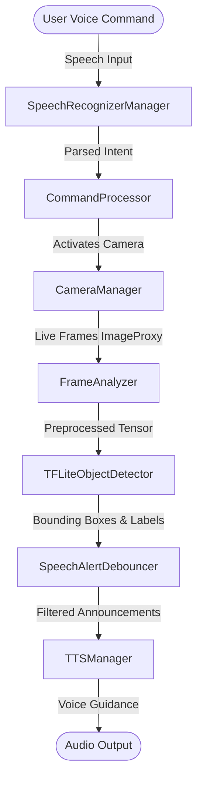

# 👁️ IntellGuide AI
> **An AI-powered Smart Assistive Companion for Visually Impaired Users**

[](https://developer.android.com)
[](https://kotlinlang.org)
[](https://www.tensorflow.org/lite)
[](https://developer.android.com/jetpack/compose)

---

## 📌 Project Overview

**Saarthi** (meaning *"Guide / Companion"*) is an intelligent Android application designed to assist **blind and visually impaired individuals** in navigating their environment safely and independently. 

By combining real-time computer vision, local machine learning models, and hands-free voice interactions, Saarthi acts as a virtual guide — recognizing surroundings, detecting obstacles, reading text, and providing clear real-time audio guidance through Text-to-Speech (TTS).

---

## ✨ Key Features

- **🎙️ Hands-Free Voice Control**: Full app functionality accessible via voice commands ("detect objects", "where am I", "emergency", "stop").
- **📷 Real-Time Object Detection**: Uses **TensorFlow Lite (SSD-MobileNet)** with CameraX to identify objects in real-time.
- **🗣️ Audio Feedback & Debouncing**: Intelligent spatial speech alerts (e.g., *"Person ahead"*, *"Car on your left"*) with automated debouncing to avoid redundant notifications.
- **📍 Emergency SOS Dispatch**: Instant alert dispatch with live location coordinates to designated emergency contacts.
- **🔍 Spatial Awareness**: Calculates relative bounding box positioning and distance estimates to warn users of immediate hazards.
- **📱 High-Contrast Accessibility UI**: Designed with high-visibility visuals for partially sighted users and full accessibility support for completely blind users.

---

## 🏗️ Technical Architecture



---

## 🛠️ Tech Stack & Dependencies

- **Language**: Kotlin
- **UI Framework**: Android Jetpack Compose, Material3
- **Computer Vision & Camera**: CameraX API
- **Machine Learning**: TensorFlow Lite Object Detection (SSD-MobileNet v1)
- **Voice Engine**: Android SpeechRecognizer API & Text-to-Speech (TTS) Engine
- **Architecture**: MVVM (Model-View-ViewModel) pattern with StateFlow

---

## 🚀 Getting Started

### Prerequisites
- Android Studio Ladybug (or newer)
- Android SDK 24+ (Android 7.0 minimum support)
- Physical Android Device (recommended for camera and sensor testing)

### Installation & Setup

1. **Clone the Repository:**
   ```bash
   git clone https://github.com/Atharva029/IntellGuide.git
   cd IntellGuide
   ```

2. **Open in Android Studio:**
   - Open Android Studio and select **Open**.
   - Navigate to the inner `IntellGuide_AI` folder and select it.

3. **Build & Run:**
   - Connect your Android device via USB or Wireless Debugging.
   - Click **Run 'app'** (`Shift + F10`).

---

## 📂 Project Structure

```
IntellGuide_AI/
├── app/src/main/java/com/intellguide/saarthi/
│   ├── camera/          # CameraX frame capture & lifecycle management
│   ├── ui/              # Jetpack Compose UI screens & ViewModels
│   ├── vision/          # TFLite object detection, labels & speech debouncer
│   └── voice/           # Voice recognition & Text-to-Speech (TTS) engines
├── assets/              # TFLite model weights (ssd_mobilenet.tflite, labels)
└── README.md
```

---

## 📄 License

This project is created for educational and assistive technology research purposes.
